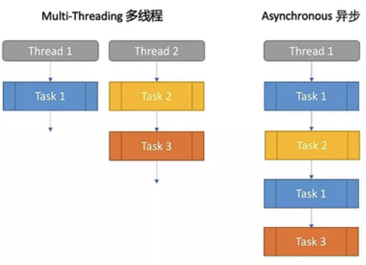
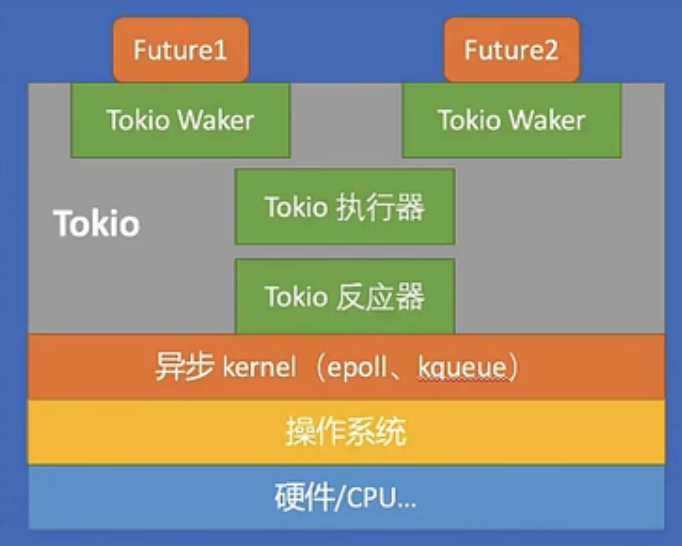

async 异步和多线程是不同的(**async 有点像协程**):

# async 的特征

- async 对 cpu 的利用率更高, 可以执行在一个线程上或多个线程上
- 需要`async`关键字标记异步函数, `await`激活 task 执行
  - 被`async 标记的函数返回一个 Future trait
- **异步运行时**负责执行的细节(下图的 tokio 是一个运行时 crate)
  - 管理一个保存 Future 的集合
  - 内部调用 Future 的`poll`方法检查 task 是否执行完成
  - 当调用`poll`后还没有完成, task 就会被注册到一个**Waker**中, 等待唤醒后下一次执行

