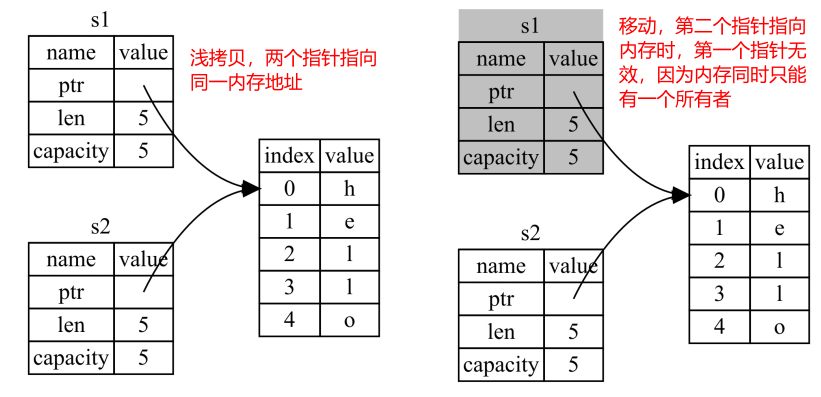
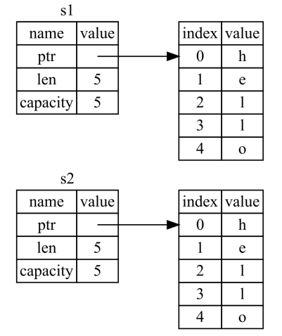
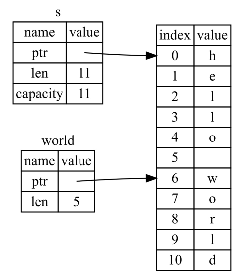

# 所有权的规则
1. **Rust 中的每一个值都有一个被称为其所有者（ owner）的变量。**
2. **值有且只有一个所有者。**
3. **当所有者（ 变量）离开作用域， 这个值将被丢弃**

上面的规则太过死板，难以灵活使用。Rust提供下面的灵活方式：
* 可以将值从一个所有者**move**到另一个所有者。这允许你构建、更改、拆除所有权树。
* 很简单的类型例如整数、浮点数和字符被所有权规则排除在外。它们被称为**Copy类型**。
* 标准库提供了引用计数的指针类型 Rc 和 Arc（类似C++智能指针），它们允许值在一定的限制下可以有多个所有者。
* 可以使用**借用一个值的引用**， 引用是生命周期受限的非占有的指针


```rust
{
    let s = String::from("hello"); // 从此处起， s 是有效的
    // 使用 s
} // 此作用域已结束，//s 不再有效    
```
当变量离开作用域， Rust 为我们调用一个特殊的函数。 这个函数叫做 drop。
> 在 C++ 中， 这种 item 在生命周期结束时释放资源的模式有时被称作 资源获取即初始化（ Resource Acquisition Is Initialization (RAII)），具体介绍参照： 


# Move
## 取代浅拷贝
看下面例子：
```rust
fn main() {
    let s1 = String::from("hello world"); //创建String变量，申请内存保存内容
    let s2 = s1; //s2指向内存，同时s1被标记无效

    println!("{}"， s1); //因为s1被丢弃，编译出错
}
```
这段代码在C++中运行没有问题，但是在Rust会编译出错，因为s1已经被标记为无效。这就涉及到C++中的**浅拷贝**和Rust中**移动**的区别了：


在 Rust 里对于大多数类型， 赋值给变量、把值传给函数、或者从函数返回值并不会拷贝这个值:它们只会move它。**源对象放弃了值的所有权，把所有权转移给了目的对象，同时源对象变为未初始化的状态**。

上面的例子，如果需要同时保持s1和s2可用，改怎么办呢？既然一个内存地址只能有一个所有者，那办法就是重新申请一块内存给s2，s1和s2指向不同的内存地址，也即C++概念中的**深拷贝。**在Rust中使用`clone`函数可以实现深拷贝，例如：
```rust
fn main() {
    let s1 = String::from("hello world");
    let s2 = s1.clone(); //深拷贝

    println!("{}， {}"， s1， s2);
}
```
深拷贝之后，内存的结构如下：


## 函数传递所有权
上面提到，对于实现了Copy trait的基本类型，移动与浅拷贝没有什么区别，对于堆上申请的内存，移动意味着所有权的转移，函数参数也不例外：
```rust
fn main() {
    let s = String::from("hello"); // s comes into scope
    takes_ownership(s); // s's value moves into the function...
                        // ... and so is no longer valid here
    println!("s: {}"， s);//s已经没有所有权了，编译失败
}

fn takes_ownership(some_string: String) {
    // some_string comes into scope
    println!("{}"， some_string);
}// Here， some_string goes out of scope and `drop` is called. The backing memory is freed.
```
当然，return函数返回值也会转移所有权：
```rust
fn main() {
    let s1 = gives_ownership();         // gives_ownership moves its return value into s1
}
fn gives_ownership() -> String {             // gives_ownership will move its
                                             // return value into the function
                                             // that calls it
    let some_string = String::from("hello"); // some_string comes into scope
    some_string                              // some_string is returned and
                                             // moves out to the calling
                                             // function
}
```

# copy类型
赋予一个 Copy 类型的值会拷贝它，而不是移动它。**源对象仍然保持初始化状态和可用性*，它的值不会发生改变**。向函数和构造器传递 Copy 类型也类似。
常见的copy类型有：
* 所有整数类型， 比如 u32 。
* 布尔类型， bool ， 它的值是 true 和 false 。
* 所有浮点数类型， 比如 f64 。
* 字符类型， char 。
* 元组和固定大小的数组， 当且仅当其包含的类型也是上面的基本类型时

默认情况下，struct 和 enum 不是 Copy 类型。但如果结构体的所有字段都是 Copy 类型， 那么你可以通过在定义上方加上属性`#[derive(Copy， Clone)]`来把它变为 Copy 类型。

# 智能指针：共享所有权
> Rust中有`Box<T>`类型的指针，可以在堆上申请内存。不过`Box`仍然是一个拥有者，无法共享所有权。

Rust 提供了引用计数类型`Rc`和`Arc`(类比C++`std::shared_ptr`)。正如你对 Rust 的期待一样，它们是安全的:你不可能忘记调整引用计数、创建其它指向它的指针、或者出现其他使用 C++ 的引用计数指针类型时可能出现的问题。
* `Rc<T>`:指向类型T，单线程内的引用计数智能指针
* `Arc<T>`:指向类型T，多线程之间共享智能指针， 相对于`Rc`有额外的性能损失

注意:
* **Rust假设`Rc`和`Arc`指针指向的值要被共享,因此它必须是不可变的。这一点是和C++智能指针最大的不同。**
* Rust提供弱指针`std::rc::Weak`来避免使用 Rc 指针创建循环的情况(类比C++`std::weak_ptr`)

示例:
```rust
use std::rc::Rc;
// Rust 可以推断出所有这些类型，写出来是为了更清楚
let s: Rc<String> = Rc::new("shirataki".to_string());
//内存不会复制，只会增加一次引用计数，注意与深拷贝的区别
let t: Rc<String> = s.clone();
let u: Rc<String> = s.clone();
//最终为三个指针指向同一内存,计数为3. 当计数为0时内存自动释放
```

# 引用：不获取所有权
**Rust引用允许使用值而不获得原有变量的所有权，更形象的应该叫借用**：

## 借用
借用引入了别名。我们可以使用引用：**从所有者那里借来**：
```rust
let v:Vec<i32> = Vec::new();
let v1 = &v;    // v1 has borrowed from v
v.len();        // fine
v1.len();       // also fine
```
与所有者不同，可以同时存在多个借用的引用：
```rust
let v:Vec<i32> = Vec::new();
let v1 = &v;     // v1 has borrowed from v
let v2 = &v;     // v2 has also borrowed from v
v.len();         // allowed
v1.len();        // also allowed
v2.len();        // also allowed
```
但是在所有者销毁后，借用者不能再访问所有者指向的内存区域数据，否则会导致一个bug(use-after-free)。
```rust
let v1: &Vec<i32>;
{
    let v =Vec::new();
    v1 = &v;
}              // v is dropped here
v1.len();      // error:borrowed value does not live long enough
```
因此，即使可能存在别名，Rust也会确保引用的生命周期不会超过被引用的对象，从而再次避免了别名和可变带来的bug。

## 可变借用
虽然可以有多个共享引用，但**一次只能有一个可变引用**:
```rust
let mut v:Vec<i32> = Vec::new();
let v1 = &mut v;     // 第一个可变借用
let v2 = &mut v;     // 第二个可变借用
v1.push(1);   // error:cannot borrow `v` as mutable more than once at a time
```
在允许可变引用进行变量可变时，Rust就禁止其他引用(共享的或可变的)。
这些借用规则防止悬空指针的出现。如果Rust同时允许可变引用和不可变引用，那么内存可能通过可变引用变得无效，而不可变引用仍然指向那个无效的内存。

例如，在下面的代码中，如果允许这样的代码通过，v1就可以访问无效的内存:
```rust
let mut v = vec![0, 1, 2, 3];    // 可变所有者
let v1 = &v[0];     // 不可变借用
v.push(4);          // Vec内部指向的内存区域发生改变，之前的缓冲区无效
let v2 = *v1;       // error: 访问无效内存区域
```
但是，类似的代码在c++中是允许编译成功的。


## 借用的规则
- **在任意给定作用域， 要么只能有一个可变引用， 要么只能有多个不可变引用**
- **引用必须总是有效的**。

这个限制的好处是 Rust 可以在**编译时就避免数据竞争**。

可以使用大括号来创建一个新的作用域， 以允许拥有多个可变引用， 只是不能同时拥有。或者在一个引用销毁之后，在定义可变引用。


# Slice：不获取所有权
一个普通的引用是一个指向单个值的无所有权指针， 而一个切片的引用是一个指向内存中连续的范围的指针。因为切片类型总是以引用的方式出现，我们也经常用**切片**来指代 &[T] 或 &str 这样的类型。
## range表示形式
** slice允许你引用集合中一段连续的元素序列**， 而不用引用整个集合。可以使用一个由中括号中的`**[starting_index..ending_index]**`指定的 range 创建一个 slice。​

以字符串为例，字符串 slice（ string slice） 是 String 中一部分值的引用，：
```rust
let s = String::from("hello world");
//对字符串的部分引用
let hello = &s[0..5];
let world = &s[6..11];
```
其内存的结构如下：



```rust
let slice = &s[..2];//从开头到index2
let slice = &s[3..];//从index3到末尾
let slice = &s[..];//整个字符串范围
```

## string slice示例
string slice的类型为`&str`，使用示例如下：
```rust
fn first_word(s: &str) -> &str {
    let bytes = s.as_bytes();
    for (i， &item) in bytes.iter().enumerate() {
        if item == b' ' {
            return &s[0..i];
        }
    }
    return &s[..];
}

fn main() {
    let my_string = String::from("hello world");
    // first_word 中传入 `String` 的 slice
    let word = first_word(&my_string[..]);
    println!("{}"， word);
    
    let my_string_literal = "hello world";
    // first_word 中传入字符串字面值的 slice
    let word = first_word(&my_string_literal[..]);
    println!("{}"， word);

    // 因为字符串字面值就是string slice，
    // 这样写也可以， 即不使用 slice 语法！
    let word = first_word(my_string_literal);
    println!("{}"， word);
}
```

## 其他slice类型
集合类型都支持slice，后面再补充
