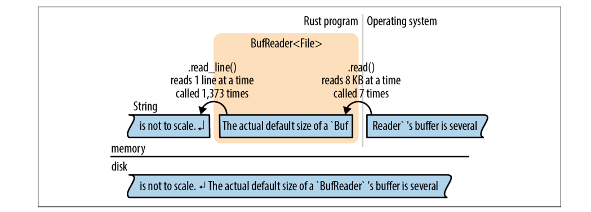
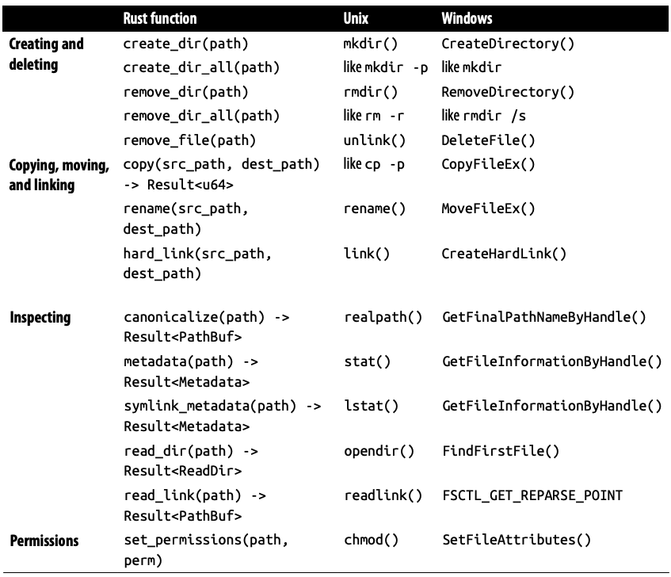

`Rust` 用于输入和输出的标准库功能围绕三个`Trait`组织：[`Read`](https://doc.rust-lang.org/std/io/trait.Read.html)、[`BufRead`](https://doc.rust-lang.org/std/io/trait.BufRead.html) 和 [`Write`](https://doc.rust-lang.org/std/io/trait.Write.html)：

- 实现 `Read` 的值具有面向字节的输入的方法，他们被称为 `Reader`；

- 实现 `BufRead` 的值是缓冲读取器，它们支持 `Read` 的所有方法，以及读取文本行等的方法；

- 实现 `Write` 的值支持面向字节和`UTF-8` 文本输出，它们被称为 `Writer`；

在本节中，将解释如何使用这些`Trait`及其方法，涵盖图中所示的读取器和写入器类型，并展示与文件、终端和网络交互的其他方式。


### `Readers`、`Writers`

`Readers` 是内容输入源，可以从哪里读取字节。例如：

- 使用 [`std::fs::File::open`](https://doc.rust-lang.org/std/fs/struct.File.html#method.open) 打开的文件；

- 可以从 [`std::net::TcpStream`](https://doc.rust-lang.org/std/net/struct.TcpStream.html) 代表的网络连接中读取数据；

- 可以从 [`std::io::stdin()`](https://doc.rust-lang.org/std/io/fn.stdin.html) 标准输入读取数据；

- [`std::io::Cursor<&[u8]>`](https://doc.rust-lang.org/std/io/struct.Cursor.html) 和 [`std::io::Cursor<Vec<u8>>`](https://doc.rust-lang.org/std/io/struct.Cursor.html) 值，它们是从已经在内存中的字节数组或`vector`中“读取”的读取器；

`Writers` 是那些你可以把值写入的地方，例如：

- 使用 `std::fs::File::create` 创建的文件；

- 基于网络连接 `std::net::TcpStream` 传输数据；

- `std::io::stdout()` 和 `std::io:stderr()` 可以用于向标准输出和标准错误写入内容；

- `std::io::Cursor<Vec<u8>>` 类似，但允许读取和写入数据，并在`vector`中寻找不同的位置；

- `std::io::Cursor<&mut [u8]>` 和上面的类似，但是不能增长内部的 `buffer`，因为它仅仅是已存在的字节数组的引用；

由于`Reader`和`Writer`有标准的 `Trait`（`std::io::Read` 和 `std::io::Write`），编写适用于各种输入或输出通道的通用代码是很常见的。 例如，这是一个将所有字节从任何读取器复制到任何写入器的函数：

```rust
use std::io::{self, ErrorKind, Read, Write};

const DEFAULT_BUF_SIZE: usize = 8 * 1024;

pub fn copy<R: ?Sized, W: ?Sized>(reader: &mut R, writer: &mut W) -> io::Result<u64>
where
    R: Read,
    W: Write,
{
    let mut buf = [0; DEFAULT_BUF_SIZE];
    let mut written = 0;
    loop {
        let len = match reader.read(&mut buf) {
            Ok(0) => return Ok(written),
            Ok(len) => len,
            Err(ref e) if e.kind() == ErrorKind::Interrupted => continue,
            Err(e) => return Err(e),
        };
        writer.write_all(&buf[..len])?;
        written += len as u64;
    }
}
```

这是 `Rust` 标准库 [`std::io::copy()`](https://doc.rust-lang.org/std/io/fn.copy.html) 的实现，因为它是泛型的，所以可以把数据从 `File` 复制到 `TcpStream`，或者从 `Stdin` 到内存中的 `Vec<u8>`。

#### `Readers`

`std::io::Read` 有几个读取数据逇方法，它们所有都以 `&mut self` 作为参数。

- `reader.read(&mut buffer)`：从数据源读取一些字节并将它们存储在给定的缓冲区中，缓冲区参数的类型是 `&mut [u8]`，这最多读取 `buffer.len()` 个字节。返回类型是 `io::Result<u64>`，它是 `Result<u64,io::Error>` 的类型别名。成功时，`u64` 值是读取的字节数，它可能等于或小于 `buffer.len()`，`Ok(0)` 表示没有数据要读取。

  出错时，`.read()` 返回 `Err(err)`，其中 `err` 是 `io::Error` 值。`io::Error` 是可打印的。对于程序，它有一个 `.kind()` 方法，该方法返回 `io::ErrorKind` 类型的错误代码。这个枚举的成员具有 `PermissionDenied` 和 `ConnectionReset` 之类的名称，大多数不可忽视的明显错误，但应特别处理一种错误，`io::ErrorKind::Interrupted` 对应 `Unix` 错误代码 `EINTR`，表示读取恰好被信号中断，除非程序被设计成巧妙地处理信号，否则它应该只是重新读去。

  `.read()` 方法非常低级，甚至继承了底层操作系统的怪癖。如果你正在为一种新型数据源实现 [`Read`](https://doc.rust-lang.org/std/io/trait.Read.html)，这会给你很大的余地，如果你试图读取一些数据，那会很痛苦。因此，`Rust` 提供了几种更高级的便利方法。它们都具有 `.read()` 方面的默认实现，它们都处理 `ErrorKind::Interrupted`，所以你不必这样做。

- `reader.read_to_end(&mut byte_vec)`：从 `Reader` 中读取剩余的输入追加到 `byte_vec`，它是 `Vec<u8>` 类型，返回 `io::Result<usize>` 表示读取的数量；

- `reader.read_to_string(&mut string)`：同上，但是追加数据到 `String` 中，如果遇到无效的 `UTF-8`，将返回 [`ErrorKind::InvalidData`](https://doc.rust-lang.org/std/io/enum.ErrorKind.html#variant.InvalidData)。在某些编程语言中，字节输入和字符输入由不同的类型处理。如今，`UTF-8` 如此占主导地位，以至于 `Rust` 承认这一事实标准并在任何地方都支持 `UTF-8`；

- `reader.read_exact(&mut buf)`：读取足够的数据以填充给定的缓冲区，参数类型是 `&[u8]`。如果读取器在读取 `buf.len()` 字节之前用完数据，则返回 `ErrorKind::UnexpectedEof` 错误；

- `reader.bytes()`：返回输入流的按字节迭代器，类型是 [`std::io::Bytes`](https://doc.rust-lang.org/std/io/struct.Bytes.html)。

- `reader.chain(reader2)`：将多个 `Reader` 连接起来，先从当前 `reader` 读取数据，如果遇到 `EOF`，则从 `reader2` 读取；

- `reader.take(n)`：创建一个适配器，该适配器最多可以从中读取限制字节。此函数返回一个新的 `Read` 实例，它最多读取`n`个字节，之后它将始终返回 `EOF (Ok(0))`。任何读取错误都不会计入读取的字节数，未来对 `read()` 的调用可能会成功。

#### `Buffered Readers`

为了提高效率，可以缓冲读取器和写入器，这仅仅意味着它们有一块内存（缓冲区），用于在内存中保存一些输入或输出数据。这减少了系统调用，如下图所示，应用程序应该从 `BufReader` 读取数据，在此示例中通过调用其 `.read_line()` 方法。`BufReader` 反过来从操作系统获取更大块的输入。



缓冲 `Reader` 实现了 [`std::io::Read`](https://doc.rust-lang.org/std/io/trait.Read.html) 和 [`std::io::BufRead`](https://doc.rust-lang.org/std/io/trait.BufRead.html) ，后者增加了下面的方法：

- `reader.read_line(&mut line)`：读取一行文本追加到 `line` 中，它是 `String` 类型，换行符 `\n` 或者 `\r\n` 都会追加到 `line` 中，返回值是 [`std::io::Result<usize>`](https://doc.rust-lang.org/std/io/type.Result.html) ，表示读取的字节数量，如果 `reader` 已经读完，则应该保持不变直接返回 `Ok(0)`；

- `reader.lines()`：在输入的行上返回一个迭代器，项目类型是 `io::Result<String>`，换行符不包含在字符串中。如果输入具有 `Windows` 样式的行尾`"\r\n"`，则两个字符都将被删除。这种方法几乎总是想要的文本输入，接下来的两节展示了它的一些使用示例；

- `reader.read_until(stop_byte, &mut byte_vec)`、`reader.split(stop_byte)`：它们就像 `.read_line()` 和 `.lines()`，但面向字节，生成 `Vec<u8>` 而不是字符串，由调用者选择分隔符 `stop_byte`；

`BufRead` 还提供了一对低级方法，[`.fill_buf()`](https://doc.rust-lang.org/std/io/trait.BufRead.html#tymethod.fill_buf) 和 [`.consume(n)`](https://doc.rust-lang.org/std/io/trait.BufRead.html#tymethod.consume)，用于直接访问读取器的内部缓冲区。

#### `Reading Lines`

这里有一个实现类似 `grep` 的函数，它搜索许多文本行，然后将它传入下一个命令：

```rust
use std::io;
use std::io::prelude::*;
fn grep(target: &str) -> io::Result<()> {
    let stdin = io::stdin();
    for line_result in stdin.lock().lines() {
        let line = line_result?;
        if line.contains(target) {
            println!("{}", line);
        }
    }
    Ok(())
}
```

由于要调用 `.lines()`，需要一个实现 `BufRead` 的输入源。在这种情况下，我们调用 `io::stdin()` 来获取通过管道传输给我们的数据。但是，`Rust` 标准库使用互斥锁保护标准输入。我们调用 `.lock()` 来锁定 `stdin` 以供当前线程独占使用，它返回一个实现 `BufRead` 的 `StdinLock` 值，在循环结束时，`StdinLock` 被丢弃，释放互斥锁。

该函数的其余部分很简单，它调用 `.lines()` 并遍历生成的迭代器。因为这个迭代器产生 `Result` 值，所以我们使用 `?` 操作员检查错误。假设我们想让我们的 `grep` 程序更进一步，并添加对在磁盘上搜索文件的支持。我们可以使这个函数通用：

```rust
fn grep<R>(target: &str, reader: R) -> io::Result<()>
where
    R: BufRead,
{
    for line_result in reader.lines() {
        let line = line_result?;
        if line.contains(target) {
            println!("{}", line);
        }
    }
    Ok(())
}
```

现在我们可以向它传递一个 `StdinLock` 或一个缓冲文件：

```rust
let stdin = io::stdin();
grep(&target, stdin.lock())?; // ok

let f = File::open(file)?;
grep(&target, BufReader::new(f))?; // also ok
```

请注意，文件不会自动缓冲，`File` 实现 `Read` 但没有实现 `BufRead`。但是，为文件或任何其他非缓冲读取器创建缓冲读取器很容易，就像 `BufReader::new(reader)`。（要设置缓冲区的大小，请使用 `BufReader::with_capacity(size, reader)`）

在大多数语言中，默认情况下文件带有缓冲功能，如果你想要无缓冲的输入或输出，你必须弄清楚如何关闭缓冲。在 `Rust` 中，`File` 和 `BufReader` 是两个独立的库功能，因为有时希望文件没有缓冲，有时希望缓冲来自网络的输入。

完整的程序如下所示：

```rust
#![allow(dead_code, unused_imports)]

use std::error::Error;
use std::fs::File;
use std::io::prelude::*;
use std::io::{self, BufReader};
use std::path::PathBuf;

fn grep<R>(target: &str, reader: R) -> io::Result<()>
where
    R: BufRead,
{
    for line_result in reader.lines() {
        let line = line_result?;
        if line.contains(target) {
            println!("{}", line);
        }
    }
    Ok(())
}

fn grep_main() -> Result<(), Box<dyn Error>> {
    // Get the command-line arguments. The first argument is the
    // string to search for; the rest are filenames.
    let mut args = std::env::args().skip(1);
    let target = match args.next() {
        Some(s) => s,
        None => Err("usage: grep PATTERN FILE...")?,
    };
    let files: Vec<PathBuf> = args.map(PathBuf::from).collect();

    if files.is_empty() {
        let stdin = io::stdin();
        grep(&target, stdin.lock())?;
    } else {
        for file in files {
            let f = File::open(file)?;
            grep(&target, BufReader::new(f))?;
        }
    }
    Ok(())
}

fn main() {
    let result = grep_main();
    if let Err(err) = result {
        eprintln!("{}", err);
        std::process::exit(1);
    }
}
```

#### `Writers`

正如我们所见，输入主要是使用方法完成的，输出有点不同，输出主要用作参数。

- `println!()` 和 `print!()`：都是将信息输出到标准输出，不同的是前者会增加一个换行符，遇到错误都 `panic`；

- `eprintln!()` 和 `eprint!()`：将信息输出到标准错误，不同的是前者会增加一个换行符，遇到错误都 `panic`；

- `writeln!()` 和 ` write!()`：将信息输出到第一个参数指定的目的地，不同的是前者会增加一个换行符，返回一个 `Result`；

[`std::io::Write`](https://doc.rust-lang.org/std/io/trait.Write.html) 有以下方法：

- `writer.write(&buf)`：将切片 `buf` 中的一些字节写入底层流。它返回一个 `io::Result<usize>`。成功时，返回写入的字节数，可能小于 `buf.len()`，与 `Reader::read()` 一样，这是一种低级方法，应避免直接使用；

- `writer.write_all(&buf)`：写入 `buf` 所有字节，返回 `io::Result<()>`；

- `writer.flush()`：将缓存的所有数据都写入底层的流中，返回 `Result<()>`；

`writer` 会被自动关闭，当它们被丢弃的时候，可以使用 [`BufWriter::new(writer)`](https://doc.rust-lang.org/std/io/struct.BufWriter.html#method.new) 基于任何 `writer` 生成一个带缓冲的 `Writer`。

```rust
let file = File::create("tmp.txt")?;
let writer = BufWriter::new(file);
```

如果要设置 `buffer` 大小，可以使用 ` BufWriter::with_capacity(size, writer)`。当 `BufWriter` 被丢弃的时候，所有缓存的数据被写入底层的 `Writer`，如果这期间发生错误，将被忽略。为了让程序处理所有可能的错误，在丢弃 `BufWriter` 之前，使用 `.flush()` 将缓存的数据写到底层的流中。

#### `Files`

下面列出常用的文件打开方法：

- [`std::fs::File::open(filename)`](https://doc.rust-lang.org/std/fs/struct.File.html#method.open)：打开已经存在的文件用于读取，返回 `std::io::Result`，如果文件返回错误；

- [`std::fs::File::create(filename)`](https://doc.rust-lang.org/std/fs/struct.File.html#method.create)：创建一个文件用于写，如果文件已经存在，将会被清空；

如果这些不满足，还可以使用 [`std::fs::OpenOptions`](https://doc.rust-lang.org/std/fs/struct.OpenOptions.html) 在打开文件时，设置更多的参数：

```rust
use std::fs::OpenOptions;
let log = OpenOptions::new()
    .append(true) // if file exists, add to the end
    .open("server.log")?;

let file = OpenOptions::new()
    .write(true)
    .create_new(true) // fail if file exists
    .open("new_file.txt")?;
```

`OpenOptions` 有几个方法用于打开文件时设置属性：

- [`.append()`](https://doc.rust-lang.org/std/fs/struct.OpenOptions.html#method.append)：设置追加模式；

- [`.create()`](https://doc.rust-lang.org/std/fs/struct.OpenOptions.html#method.create)：如果文件存在则打开，不存在则创建；

- [`.create_new()`](https://doc.rust-lang.org/std/fs/struct.OpenOptions.html#method.create_new)：创建新文件，如果文件已经存在则会失败，这个 `option` 是原子的，另外如果该选项设置，`.create()` 和 `.truncate()` 就被忽略；

- [`.read()`](https://doc.rust-lang.org/std/fs/struct.OpenOptions.html#method.read)：设置读权限；

- [`.truncate()`](https://doc.rust-lang.org/std/fs/struct.OpenOptions.html#method.truncate)：如果文件已经存在，清空文件；

- [`.write()`](https://doc.rust-lang.org/std/fs/struct.OpenOptions.html#method.write)：设置写权限；

#### `Seeking`

`File` 也实现了 [`std::io::Seek`](https://doc.rust-lang.org/std/io/trait.Seek.html)，这意味着可以在 `File` 内跳转，而不是从头到尾一次读取或写入，`Seek` 是这样定义的：

```rust
pub trait Seek {
    fn seek(&mut self, pos: SeekFrom) -> io::Result<u64>;
}
pub enum SeekFrom {
    Start(u64),
    End(i64),
    Current(i64)
}
```

在文件内跳来跳去效率很低，无论是机械硬盘还是固态硬盘，一次寻址所需的时间都与读取几兆字节的数据一样长。

#### 其他读写类型

这里有其他的读写类型：

- [`io::stdin()`](std::io::stdin)：返回标准输入用于数据读取，返回值的类型是 [`std::io::Stdin`](https://doc.rust-lang.org/std/io/struct.Stdin.html)，因为这个被所有线程共享，所以每次使用都需要使用互斥锁。

  `Stdin` 的 `.lock` 方法返回 [`io::StdinLock`](https://doc.rust-lang.org/std/io/struct.StdinLock.html)，它是一个带缓冲的 `Reader` 持有互斥锁直到丢弃。

  出于技术原因，`io::stdin().lock()` 是无效的，锁持有 `Stdin` 的引用，这意味着 `Stdin` 必须被存在一个变量中以至于它的生命周期足够长：

  ```rust
  let stdin = io::stdin();
  let lines = stdin.lock().lines(); // ok
  ```

- [`io::stdout()`](https://doc.rust-lang.org/std/io/fn.stdout.html)、[`io::stderr()`](https://doc.rust-lang.org/std/io/fn.stderr.html)：返回标准输出和标准错误用于数据写入，它们也有 `.lock` 方法；

- `Vec<u8>`：实现了 `std::io::Write`，写入数据到 `u8` 序列；

- [`std::io::Cursor::new(buf)`](https://doc.rust-lang.org/std/io/struct.Cursor.html)：创建一个 `Cursor`，一个从 `buf` 读取的缓冲读取器，这就是创建读取字符串的阅读器的方式。参数 `buf` 可以是任何实现 `AsRef<[u8]>` 的类型，因此也可以传递 `&[u8]`、`&str` 或 `Vec<u8>`。

  `Cursor` 在内部是很简单的，它们只有两个字段：`buf` 本身和一个整数，即 `buf` 中下一次读取将开始的偏移量，该位置最初为 `0`。

  `Cursor` 实现 `Read`、`BufRead` 和 `Seek`，如果 `buf` 的类型是 `&mut [u8]` 或 `Vec<u8>`，那么 `Cursor` 也会实现 `Write`。写入 `Curosr` 会覆盖 `buf` 中从当前位置开始的字节。如果试图写超出 `&mut [u8]` 的末尾，会得到一个部分写或一个 `io::Error`。不过，使用 `Curosr` 写入 `Vec<u8>` 的末尾是可以的，它会增大 `vector`。因此，`Cursor<&mut [u8]>` 和 `Cursor<Vec<u8>>` 实现了所有 `4` 个 `std::io::prelude` 中的 `Trait`。

- [`std::net::TcpStream`](https://doc.rust-lang.org/std/net/struct.TcpStream.html)：代表底层的 TCP 连接，可读可写；`TcpStream::connect(("hostname", PORT))` 尝试去连接到一个 `server` 并且返回 `io::Result<TcpStream>`。

- [`std::process::Command`](https://doc.rust-lang.org/std/process/struct.Command.html)：支持生成子进程并将数据传输到其标准输入，如下所示：

  ```rust
  use std::error::Error;
  use std::io::Write;
  use std::process::{Command, Stdio};

  fn main() -> Result<(), Box<dyn Error + Send + Sync + 'static>> {
      let mut child = Command::new("grep")
          .arg("-e")
          .arg("a.*e.*i.*o.*u")
          .stdin(Stdio::piped())
          .spawn()?;

      let my_words = vec!["hello", "world"];
      let mut to_child = child.stdin.take().unwrap();
      for word in my_words {
          writeln!(to_child, "{}", word)?;
      }
      drop(to_child); // close grep's stdin, so it will exit
      child.wait()?;

      Ok(())
  }
  ```

  `child.stdin` 的类型是 `Option<std::process::ChildStdin>`，在这里在设置子进程时使用 `.stdin(Stdio::piped())`，所以 当 `.spawn()` 成功时，`child.stdin` 肯定会被填充。如果没有，`child.stdin` 将是 `None`。`Command` 也有类似的方法 `.stdout()` 和 `.stderr()`，可以用来请求 `child.stdout` 和 `child.stderr` 中的读取器。

`std::io` 模块还提供了一些返回实验性的的读取器和写入器的函数：

- `io::sink()`：没有实际操作，所有写操作返回 `Ok`，但是数据被丢弃了；

- `io::empty()`：总是读取成功，但返回属于结束；

- `io::repeat(byte)`：返回 `Reader` 无止境地重复给定字节；

#### 二进制数据、压缩、序列化

许多开源库构建于 `std::io` 之上提供了很多额外的功能。[`byteorder`](https://crates.io/crates/byteorder) 提供了 `ReadBytesExt` 和 `WriteBytesExt` 用于二进制数据的读写：

```rust
use byteorder::{ReadBytesExt, WriteBytesExt, LittleEndian};

let n = reader.read_u32::<LittleEndian>()?;
writer.write_i64::<LittleEndian>(n as i64)?;
```

[`flate2`](https://crates.io/crates/flate2) 提供读取压缩数据的方法：

```rust
use flate2::read::GzDecoder;
let file = File::open("access.log.gz")?;
let mut gzip_reader = GzDecoder::new(file);
```

[`serde`](https://crates.io/crates/serde) 关联的 [`serde_json`](https://crates.io/crates/serde_json) 实现了数据的序列化和反序列化。

`serde` 也提供了两个关键的 `Trait` 这用于自动派生序列化和反序列化功能：

```rust
use serde::{Deserialize, Serialize};
use std::error::Error;

#[derive(Serialize, Deserialize)]
struct Player {
    location: String,
    items: Vec<String>,
    health: u32,
}
fn main() -> Result<(), Box<dyn Error + Send + Sync + 'static>> {
    let player = Player {
        location: "ShangHai".to_string(),
        items: vec!["apple".to_string()],
        health: 32,
    };
    serde_json::to_writer(&mut std::io::stdout(), &player)?;
    Ok(())
}
```

这将输出：

    {"location":"ShangHai","items":["apple"],"health":32}

由于派生代码会使编译时间变长，所以使用这个功能需要显示声明：

```toml
[dependencies]
serde = { version = "1.0", features = ["derive"] }
serde_json = "1.0"
```

### 文件和目录

现在我们已经展示了如何使用读取器和写入器，接下来的几节将介绍 Rust 处理文件和目录的特性，它们位于 `std::path` 和 `std::fs` 模块中，所有这些功能都涉及使用文件名，因此我们将从文件名类型开始。

#### `OsStr`、`Path`

操作系统不会强制文件名是有效的 `Unicode`，下面是两个创建文本文件的 `shell` 命令，只有第一个使用有效的 `UTF-8` 文件名：

```
$ echo "hello world" > ô.txt
$ echo "O brave new world, that has such filenames in't" > $'\xf4'.txt
```

对于内核，任何字节串（不包括空字节和斜杠）都是可接受的文件名。在 `Windows` 上也有类似的情况，几乎任何 `16`位“宽字符”字符串都是可接受的文件名，即使是无效的 `UTF-16` 字符串也是如此。操作系统处理的其他字符串也是如此，例如命令行参数和环境变量。

`Rust` 字符串始终是有效的 `Unicode`，文件名在实践中几乎总是 `Unicode`，但 `Rust` 必须以某种方式应对它们不是的情况，这就是 `Rust` 有 [`std::ffi::OsStr`](https://doc.rust-lang.org/std/ffi/struct.OsStr.html) 和 [`OsString`](https://doc.rust-lang.org/std/ffi/struct.OsString.html) 的原因。

`OsStr` 是一个字符串类型，它是 `UTF-8` 的超集。它的工作是能够表示当前系统上的所有文件名、命令行参数和环境变量，无论它们是否是有效的 `Unicode`。在 `Unix` 上，一个 `OsStr` 可以保存任何字节序列。在 `Windows` 上，`OsStr` 使用 `UTF-8` 的扩展存储，该扩展可以编码任何 `16` 位值序列，包括不匹配的。

所以我们有两种字符串类型：`str` 用于实际的 `Unicode` 字符串；`OsStr` 用于操作系统可以发出的任何东西。我们将再介绍一个：`std::path::Path`，用于文件名。`Path` 与 `OsStr` 完全相同，但它添加了许多方便的文件名相关方法。

最后，对于每个字符串类型，都有一个对应的 `owning` 类型：一个 `String` 拥有一个堆分配的 `str`，一个 `std::ffi::OsString` 拥有一个堆分配的 `OsStr`，一个 `std::path::PathBuf` 拥有一个堆分配的 `Path`。


所有这三种类型都实现了一个共同的特征，`AsRef<Path>`，因此我们可以轻松地声明一个接受“任何文件名类型”作为参数的泛型函数。

```rust
use std::io;
use std::path::Path;
fn swizzle_file<P>(path_arg: P) -> io::Result<()>
where
    P: AsRef<Path>,
{
    let path = path_arg.as_ref();
}
```

#### `Path`、`PathBuf`

`Path` 提供以下方法：

- `Path::new(str)`：转换 `&str` 或者 `&OsStr` 为 `&Path`，转换过程中不发生复制，`&Path` 指向原始 `&str` 或者 `&OsStr` 的相同字节；

  ```rust
  use std::path::Path;
  let home_dir = Path::new("/home/fwolfe");
  ```

- `path.parent()`：返回路径父目录，以 `Option<&Path>` 表示，父目录的路径仅仅是当前路径的子串：

  ```rust
  assert_eq!(Path::new("/home/fwolfe/program.txt").parent(),
  Some(Path::new("/home/fwolfe")));
  ```

- `path.file_name()`：返回路径中的最后一个部分，返回类型是 `Option<&OsStr>`。例如：

  ```rust
  use std::ffi::OsStr;
  assert_eq!(Path::new("/home/fwolfe/program.txt").file_name(),
      Some(OsStr::new("program.txt")));
  ```

- `path.is_absolute(), path.is_relative()`：相对路径还是绝对路径；

- `path1.join(path2)`：连接两个新路径，返回新的 `PathBuf`：

  ```rust
  let path1 = Path::new("/usr/share/dict");
  assert_eq!(path1.join("words"), Path::new("/usr/share/dict/words"));
  ```

  如果 `path2` 是绝对路径，仅仅返回 `path2` 的副本，所以这个方法能被用于转换任何路径为绝对路径：

  ```rust
  let abs_path = std::env::current_dir()?.join(any_path);
  ```

- `path.components()`：返回一个迭代器，包含给定路径从左至右的所有部分，内容类型是 [`std::path::Component`](https://doc.rust-lang.org/std/path/enum.Component.html)，它是一个枚举，能代表一个文件路径中所有不同的片段：

  ```rust
  pub enum Component<'a> {
      Prefix(PrefixComponent<'a>),
      RootDir,
      CurDir,
      ParentDir,
      Normal(&'a OsStr),
  }
  ```

- `path.ancestors()`：返回一个迭代器，返回当前文件或者目录的祖先直到根目录。每个 `item` 类型是 `Path`，第一个是它自己：

  ```rust
  let file = Path::new("/home/jimb/calendars/calendar-18x18.pdf");
  assert_eq!(
      file.ancestors().collect::<Vec<_>>(),
      vec![
          Path::new("/home/jimb/calendars/calendar-18x18.pdf"),
          Path::new("/home/jimb/calendars"),
          Path::new("/home/jimb"),
          Path::new("/home"),
          Path::new("/")
      ]
  );
  ```

这些方法适用于内存中的字符串，`Path` 也有一些查询文件系统的方法：`.exists()`、`.is_file()`、`.is_dir()`、`.read_dir()`、.`canonicalize()` 等等。 将 `Path `转换为字符串有三种方法，每一个都允许 `Path` 中出现无效 `UTF-8` 的可能性：

- `path.to_str()`：返回 `Option<&str>`，如果包含无效的 `UTF-8`，返回 `None`；

- `path.to_string_lossy()`：这基本上是同一件事，但它设法在所有情况下返回某种字符串。如果路径不是有效的 `UTF-8`，这些方法会创建一个副本，用 `Unicode` 替换字符 `U+FFFD ('�')` 替换每个无效的字节序列；

- `path.display()`：用于路径打印，它返回的值不是字符串，但它实现了 `std::fmt::Display`，因此它可以与 `format!()`、`println!()` 等一起使用。 如果路径不是有效的 `UTF-8`，则输出可能包含 `�` 字符。

  ```rust
  println!("Download found. You put it in: {}", dir_path.display());
  ```

#### 文件系统访问

下表列出了 [`std::fs`](https://doc.rust-lang.org/std/fs/index.html#functions) 提供的用于文件系统访问的函数：



`Rust` 提供了可在 `Windows` 以及 `macOS`、`Linux` 和其他 `Unix` 系统上行为一致的可移植函数。

所有这些功能都是通过调用操作系统来实现的，例如，`std::fs::canonicalize(path)` 不仅仅使用字符串处理来消除 `.` 和`..`从给定的路径。它使用当前工作目录解析相对路径，并追踪符号链接，如果路径不存在，则为错误。

由 [`std::fs::metadata(path)`](https://doc.rust-lang.org/std/fs/fn.metadata.html) 和 `std::fs::symlink_metadata(path)` 包含文件类型和大小、权限和时间戳等信息。为方便起见，`Path` 类型有一些内置方法：例如，`path.metadata()` 与 `std::fs::metadata(path)` 相同。

#### 目录读取

可以使用 [`std::fs::read_dir`](https://doc.rust-lang.org/std/fs/fn.read_dir.html) 列出目录中的内容，或者使用 [`path::read_dir()`](https://doc.rust-lang.org/std/path/struct.Path.html#method.read_dir) :

```rust
for entry_result in path.read_dir()? {
    let entry = entry_result?;
    println!("{}", entry.file_name().to_string_lossy());
}
```

注意 `?` 的两种用法，在这段代码中，第一行检查打开目录的错误，第二行检查读取下一个条目的错误。[`std::fs::DirEntry`](https://doc.rust-lang.org/std/fs/struct.DirEntry.html) 一些方法：

- `entry.file_name()`：目录或者文件的名称，类型是 `OsString`；

- `entry.path()`：文件或者目录路径，如果我们正在浏览的目录是 `/home/jimb`，`entry.file_name()` 是 `".emacs"`，那么 `entry.path()` 将返回 `PathBuf::from("/home/jimb/.emacs")`；

- `entry.file_type()`：返回 `io::Result<FileType>`，`FileType` 有 `.is_file(), .is_dir(), .is_symlink()` 方法；

当读取目录的时候，`.` 和 `..` 不会包括在内。下面是一个递归复制目录的方法：

```rust
use std::fs;
use std::io;
use std::path::Path;

/// Copy the existing directory `src` to the target path `dst`.
fn copy_dir_to(src: &Path, dst: &Path) -> io::Result<()> {
    if !dst.is_dir() {
        fs::create_dir(dst)?;
    }
    for entry_result in src.read_dir()? {
        let entry = entry_result?;
        let file_type = entry.file_type()?;
        copy_to(&entry.path(), &file_type, &dst.join(entry.file_name()))?;
    }
    Ok(())
}

/// Copy wha tever is at `src` to the target path `dst`.
fn copy_to(src: &Path, src_type: &fs::FileType, dst: &Path) -> io::Result<()> {
    if src_type.is_file() {
        fs::copy(src, dst)?;
    } else if src_type.is_dir() {
        copy_dir_to(src, dst)?;
    } else {
        return Err(io::Error::new(
            io::ErrorKind::Other,
            format!("don't know how to copy: {}", src.display()),
        ));
    }
    Ok(())
}
```

#### 平台特定功能

上面的例子中，如果我们是在 `Unix` 系统中，将会遇到符号链接，但是符号链接 `Windows` 系统又没有，`Rust` 使用条件编译解决此类问题。对于这个场景，可以使用 `use std::os::unix::fs::symlink`，下面是完整程序：

```rust
use std::error::Error;
use std::fs;
use std::io;
use std::path::Path;

#[cfg(unix)]
use std::os::unix::fs::symlink;

/// Copy the existing directory `src` to the target path `dst`.
fn copy_dir_to(src: &Path, dst: &Path) -> io::Result<()> {
    if !dst.is_dir() {
        fs::create_dir(dst)?;
    }
    for entry_result in src.read_dir()? {
        let entry = entry_result?;
        let file_type = entry.file_type()?;
        copy_to(&entry.path(), &file_type, &dst.join(entry.file_name()))?;
    }
    Ok(())
}

/// Copy wha tever is at `src` to the target path `dst`.
fn copy_to(src: &Path, src_type: &fs::FileType, dst: &Path) -> io::Result<()> {
    if src_type.is_file() {
        fs::copy(src, dst)?;
    } else if src_type.is_dir() {
        copy_dir_to(src, dst)?;
    } else if src_type.is_symlink() {
        let target = src.read_link()?;
        symlink(target, dst)?;
    } else {
        return Err(io::Error::new(
            io::ErrorKind::Other,
            format!("don't know how to copy: {}", src.display()),
        ));
    }
    Ok(())
}

/// Stub implementation of `symlink` for platforms that don't provide it.
#[cfg(not(unix))]
fn symlink<P: AsRef<Path>, Q: AsRef<Path>>(src: P, _dst: Q) -> std::io::Result<()> {
    Err(io::Error::new(
        io::ErrorKind::Other,
        format!("can't copy symbolic link: {}", src.as_ref().display()),
    ))
}
```

使用 `#[cfg(unix)]` 和 `#[cfg(not(unix))]` 我们区分了 `Unix` 和 非 `Unix` 平台。大多数 `Unix` 特定的特性不是独立的函数，而是向标准库类型添加新方法的扩展特性，有一个 [`preclude`](https://doc.rust-lang.org/std/os/unix/prelude/index.html) 模块可用于一次启用所有这些扩展：

```rust
use std::os::unix::prelude::*;
```

例如，在 `Unix` 上，这会为 `std::fs::Permissions` 添加一个 `.mode()` 方法，提供对表示 `Unix` 权限的底层 `u32` 值的访问。还有 `std::fs::Metadata` 在 `unix` 系统上扩展了 `std::os::unix::fs::MetadataExt`，能够获取`UID`，`UID` 等信息。

### `Networking`

对于底层网络代码，从 `std::net` 模块开始，它为 `TCP` 和 `UDP` 网络提供跨平台支持，使用 `native_tls crate` 来支持 `SSL/TLS`。

这些模块为网络上直接的、阻塞的输入和输出提供了构建块，可以用几行代码编写一个简单的服务器，使用 `std::net` 并为每个连接生成一个线程。 例如，这是一个`"echo"`服务器：

```rust
use std::io;
use std::net::TcpListener;
use std::thread::spawn;
/// Accept connections forever, spawning a thread for each one.
fn echo_main(addr: &str) -> io::Result<()> {
    let listener = TcpListener::bind(addr)?;
    println!("listening on {}", addr);
    loop {
        // Wait for a client to connect.
        let (mut stream, addr) = listener.accept()?;
        println!("connection received from {}", addr);
        // Spawn a thread to handle this client.
        let mut write_stream = stream.try_clone()?;
        spawn(move || {
            // Echo everything we receive from `stream` back to it.
            io::copy(&mut stream, &mut write_stream).expect("error in client thread: ");
            println!("connection closed");
        });
    }
}
fn main() {
    echo_main("127.0.0.1:17007").expect("error: ");
}
```

回显服务器只是简单地重复您发送给它的所有内容，这种代码与用 `Java` 或 `Python` 编写的代码没有太大区别。但是，对于高性能服务器，需要使用异步输入和输出，后面将介绍 `Rust` 对异步编程的支持，并展示了网络客户端和服务器的完整代码。

第三方 `crate` 支持更高级别的协议。例如，[`reqwest`](https://crates.io/crates/reqwest) 为 `HTTP` 客户端提供了一个漂亮的 `API`。`actix-web` 提供了高级功能，例如服务和转换特征，它们可以帮助从可插入的部分组成应用程序。`websocket` 实现了 `WebSocket` 协议。
