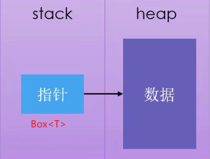

# 智能指针的内部实现
智能指针通常使用struct实现，并实现了如下两个trait接口
* deref trait：允许智能指针像引用一样使用, 自定义解引用符号`*`的代码
* drop trait：智能指针走出作用域时执行的代码(**C++析构函数**)

## deref trait
deref trait要求我们实现一个deref方法, **该方法借用self返回一个指向内部数据的引用**.
* **deref时返回不可变的引用.要重载可变引用的*运算符, 应该使用deferMut trait**.
```rust
use std::ops::Deref;

impl<T> Deref for MyBox<T> {
    type Target = T;

    fn deref(&self) -> &Self::Target {
        &self.0
    }
}

struct MyBox<T>(T);

impl<T> MyBox<T> {
    fn new(x: T) -> MyBox<T> {
        MyBox(x)
    }
}

fn main() {
    let y = MyBox::new(x);
    assert_eq!(5, *y);
}
```

# 智能指针分类
## `Box<T>`简单指针
`Box<T>`是最简单的智能指针，等同于C++中的*T，主要特点如下：
* 允许在heap上存储数据，指针本身存在stack上.
* 离开作用域时,heap和stack上内存都会被释放
* 指针是heap数据的所有权拥有者，不能共享所有权
* 没有性能开销
* 没有其他额外功能



```rust
fn main() {
    let b = Box::new(5);
    println!("b = {}", b);
}
```

## `Rc<T>`不可变共享指针
Rust 提供了引用计数类型`Rc`和`Arc`(类比C++`std::shared_ptr`)
* `Rc<T>`:指向类型T，单线程内的引用计数智能指针(不可变)
* `Arc<T>`:指向类型T，多线程之间共享智能指针， 相对于`Rc`有额外的性能损失

注意:
* **Rust假设`Rc`和`Arc`指针指向的值要被共享,因此它必须是不可变的。这一点是和C++智能指针最大的不同。**
* Rust提供弱指针`std::rc::Weak`来避免使用 Rc 指针创建循环的情况(类比C++`std::weak_ptr`)

```rust
use std::rc::Rc;
// Rust 可以推断出类型，写出来是为了更清楚
let s: Rc<String> = Rc::new("shirataki".to_string());
//内存不会复制，只会增加一次引用计数，注意与深拷贝的区别
let t: Rc<String> = Rc::clone(&s);
let u: Rc<String> = Rc::clone(&s);
//最终为三个指针指向同一内存,计数为3. 当计数为0时内存自动释放
let w: Weak<String> =Rc::downgrade(&s); // 创建弱引用, 不影响计数
```

## `RefCell<T>`可变指针
上面的`Rc<T>`虽然可以共享数据, 但是无法修改数据, 要修改数据需要使用RefCell, 它们的区别如下:

* 对于引用和`Box<T>`，借用规则的不可变性作用于编译时。对于` RefCell<T>`，这些不可变性作用于运行时。对于引用，如果违反这些规则，会得到一个编译错误。而对于`RefCell<T>`，如果违反这些规则程序会 panic 并退出。
* **因为`RefCell<T>` 允许在运行时执行可变借用检查，所以我们可以在即便 `RefCell<T>` 自身是不可变的情况下修改其内部的值**.

`RefCell<T>`会在运行时记录借用信息:
* borrow方法: 返回`Ref<T>`
    * 每次调用borrow,不可变引用计数+1
    * 当`Ref<T>`离开作用域, 不可变引用计数-1
* borrow_nut方法: 返回`RefMut<T>`
    * 每次调用borrow_mut, 可变引用技术+1
    * 当`RefMut<T>`离开作用域, 可变引用计数-1

**`RefCell<T>` 的一个常见用法是与 `Rc<T>` 结合**。`Rc<T>` 允许对相同数据有多个所有者，不过只能提供数据的不可变访问。如果有一个储存了 `RefCell<T>` 的 `Rc<T>` 的话，就可以得到有多个所有者并且可以修改的值了！